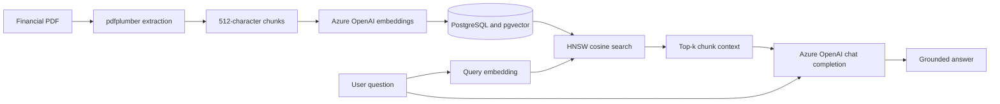

## Overview

This project implements a retrieval-augmented generation (RAG) pipeline for
answering questions about financial documents. It extracts prose and tables
from a PDF, splits the content into overlapping chunks, generates embeddings
with Azure OpenAI, and stores those vectors in PostgreSQL with pgvector. At
query time, it retrieves the nearest chunks by cosine distance and supplies
them to an Azure OpenAI chat deployment as grounding context.

The included experiment uses a CAVA Form 10-K and a set of 30 synthetic
financial-analysis questions. The reusable implementation is under
`rag_pgvector/src`; the notebooks under `rag_pgvector/exps` orchestrate data
ingestion, interactive queries, and evaluation. The root `main.py` is currently
a placeholder and does not run the RAG pipeline.

## Architecture



The system has two workflows:

1. The ingestion workflow parses, chunks, embeds, and stores a PDF.
2. The query workflow embeds a question, retrieves similar chunks, and asks the
 chat model to answer from that context.

## Ingestion Implementation

### PDF extraction

`rag_pgvector/src/data/processing.py` uses `pdfplumber` to process each page
independently. `load_pdf()` returns one dictionary per page with the following
fields:

* `page`: One-based page number
* `has_table`: Whether `pdfplumber` detected at least one table
* `table_content`: Extracted tables represented as pipe-delimited text
* `text`: Page text excluding characters inside detected table bounding boxes

Tables are extracted separately so their row structure remains visible to the
embedding and chat models. For each detected table, the implementation also
looks up to 40 points above its bounding box for a likely header. Table
characters are then filtered out of normal page extraction to avoid indexing
the same content twice.

### Chunking

`rag_pgvector/exps/chunking.ipynb` combines each page's prose and table content,
then uses LangChain's `RecursiveCharacterTextSplitter` with these defaults:

* Chunk size: 512 characters
* Chunk overlap: 64 characters
* Boundary: Each page is chunked separately

Page-level chunking preserves the source page number on every stored record.
The overlap reduces the chance that an answer-bearing sentence is split across
two unrelated retrieval units.

### Embedding generation

`rag_pgvector/src/models/embeddings.py` creates an authenticated `AzureOpenAI`
client and supports both single-text and batch requests:

* `generate_embedding()` embeds one query or metric input
* `generate_batch_embeddings()` embeds all chunks from one page in one request

The current pipeline requests 786 dimensions for both document and query
vectors. Batch results are converted into records containing a UUID, page,
text, UTC timestamp, and vector. The embedding deployment must support the
requested dimensionality, and the table dimension must match it.

### PostgreSQL storage

`rag_pgvector/src/utils/db_utils.py` uses `psycopg2` for database access.
`create_embedding_table()` enables pgvector, creates the requested schema, and
creates this logical table structure:

```sql
CREATE TABLE rag.embeddings (
  id TEXT NOT NULL,
  page TEXT,
  text TEXT,
  timestamp TIMESTAMPTZ NOT NULL,
  embedding VECTOR(786)
);
```

It also creates an HNSW index with the `vector_cosine_ops` operator class.
Before insertion, each DataFrame row is validated through the Pydantic
`EmbeddingRow` model. `load_embeddings()` then performs a bulk insert with
`psycopg2.extras.execute_values` and casts serialized Python vectors to the
pgvector type.

## Query Implementation

The reusable query path is `get_response()` in
`rag_pgvector/src/metrics/eval.py`. The chat notebook contains the same flow for
interactive experimentation:

1. `DefaultAzureCredential` obtains a bearer token for
 `https://cognitiveservices.azure.com/.default`.
2. `generate_embedding()` maps the user's question to a 786-dimensional
 vector.
3. `query_similar_chunks()` searches `rag.embeddings` with pgvector's cosine
 distance operator, `<=>`.
4. Retrieved chunk text is concatenated with blank lines in nearest-first
 order.
5. `chat_completion()` sends the question and context to the configured Azure
 OpenAI chat deployment.

The retrieval query is parameterized and orders results as follows:

```sql
SELECT id, page, text, timestamp, embedding,
   embedding <=> %s::vector AS cosine_distance
FROM rag.embeddings
ORDER BY embedding <=> %s::vector
LIMIT %s;
```

`top_k` controls how many chunks enter the prompt. The chat system instruction
frames the model as a financial analyst, asks it to answer accurately and
concisely from the supplied context, and requires `I don't know.` when the
answer is absent. Responses are capped at 500 completion tokens.

## Evaluation

`rag_pgvector/src/data/synthetic_qs.py` defines 30 questions covering CAVA's
operations, financial performance, liquidity, risks, and governance.
`run_metrics_evaluation()` evaluates every question against each combination
of `temperature` and `top_k`, records end-to-end response latency, and returns a
Pandas DataFrame.

`rag_pgvector/src/metrics/semantic.py` embeds the relevant text pairs and
computes normalized cosine similarity:

$$
\cos(a,b) =
\frac{a}{\lVert a \rVert_2} \cdot
\frac{b}{\lVert b \rVert_2}
$$

The reported metrics are:

* Answer relevance: Similarity between the question and generated answer
* Context relevance: Similarity between the question and retrieved context
* Faithfulness: Similarity between the retrieved context and generated answer
* Hallucination risk: $1 - \text{faithfulness}$
* Response time: Wall-clock duration of retrieval and answer generation

These are embedding-similarity heuristics, not claim-level factuality checks.
The chat notebook saves raw runs to `results.csv`, aggregates means by
temperature and `top_k`, and plots the resulting quality metrics.

## Project Layout

```text
.
|-- main.py                         # Placeholder entry point
|-- pyproject.toml                  # Python metadata and dependencies
|-- results.csv                     # Saved parameter-sweep results
|-- rag_pgvector/
|   |-- exps/
|   |   |-- chunking.ipynb          # PDF ingestion and indexing
|   |   |-- chat_completion.ipynb   # Retrieval, generation, and evaluation
|   |   `-- exp.ipynb               # Earlier exploratory experiments
|   `-- src/
|       |-- data/
|       |   |-- processing.py       # PDF and table extraction
|       |   |-- query_pg.py         # Cosine nearest-neighbor query
|       |   `-- synthetic_qs.py     # Evaluation question set
|       |-- metrics/
|       |   |-- eval.py             # End-to-end RAG and parameter sweep
|       |   `-- semantic.py         # Embedding-based metrics
|       |-- models/
|       |   |-- chat_completion.py  # Azure OpenAI chat client
|       |   `-- embeddings.py       # Single and batch embeddings
|       `-- utils/
|           |-- db_utils.py         # pgvector schema, inserts, and queries
|           `-- utils.py            # Azure identity and notebook helpers
`-- uv.toml                         # Python package index configuration
```

## Prerequisites

* Python 3.11 or later
* `uv` for dependency installation
* An Azure OpenAI resource with chat and embedding deployments
* An Azure identity authorized to invoke both deployments
* PostgreSQL with permission to install the pgvector extension and create a
  schema
* Azure CLI login for local `DefaultAzureCredential` authentication

## Configuration

Create a root `.env` file with these values:

```dotenv
ENDPOINT=https://<resource-name>.openai.azure.com/
DEPLOYMENT=<chat-deployment-name>
API_VERSION=<chat-api-version>
EMBEDDING_MODEL=<embedding-deployment-name>
EMBEDDING_API_VERSION=<embedding-api-version>
PG_HOST=<postgres-host>
PG_PORT=5432
PG_DBNAME=rag
PG_USER=<postgres-user>
PG_PWD=<postgres-password>
```

The current implementation uses `PG_DBNAME` both as the PostgreSQL database
name and as the schema created by the ingestion notebook. Retrieval is hard
coded to `rag.embeddings`, so `PG_DBNAME=rag` is required unless the query or
schema arguments are changed.

Authentication does not use an Azure OpenAI API key. `get_token_provider()`
uses `DefaultAzureCredential`, which can consume an existing Azure CLI login:

```bash
az login
```

## Setup and Execution

Install the locked dependencies from the repository root:

```bash
uv sync
```

Place the source PDF at `rag_pgvector/src/data/cava10k.pdf`, or update the path
in the chunking notebook. Then run the notebooks in this order:

1. Open `rag_pgvector/exps/chunking.ipynb` and select the environment created by
 `uv sync` as its kernel.
2. Update the first cell's hard-coded working directory for your checkout.
3. Run all cells to parse the PDF, create `rag.embeddings`, generate vectors,
 and insert the chunks.
4. Open `rag_pgvector/exps/chat_completion.ipynb` and update its first cell's
 working directory.
5. Run the retrieval cells for an interactive question or run the evaluation
 cells to execute the parameter grid and regenerate `results.csv`.

Ingestion appends rows and does not deduplicate existing chunks. Re-running the
chunking notebook against the same database will therefore create duplicates.
